# Telegram Lead Capture Bot to Google Sheets

Portfolio demo of a Telegram bot that collects contact requests, saves completed leads to Google Sheets, and can notify an admin in Telegram.

The project is designed for client review and adaptation. It uses placeholder configuration in the repository; real tokens, credentials, chat IDs, and private customer data must stay in local environment files or deployment secrets.

## Overview

The bot guides a user through a short lead capture flow:

1. Name
2. Email
3. Phone number or Telegram username
4. Request message
5. Confirmation after submission

When Google Sheets is configured, the bot appends the lead to a formatted worksheet. When admin notifications are configured, it sends a Telegram message to the configured admin chat.

## Features

- Guided Telegram lead form
- Email validation
- Short-message validation
- Google Sheets append integration
- Automatically formatted Google Sheet headers, frozen first row, readable widths, and wrapped text
- Optional admin Telegram notification
- Demo mode when Google Sheets or admin settings are not connected
- Startup and lead logs without Telegram API token URLs
- `.env.example` for safe setup without committing secrets

## Demo Screenshots

| View | Screenshot |
|---|---|
| Start menu | 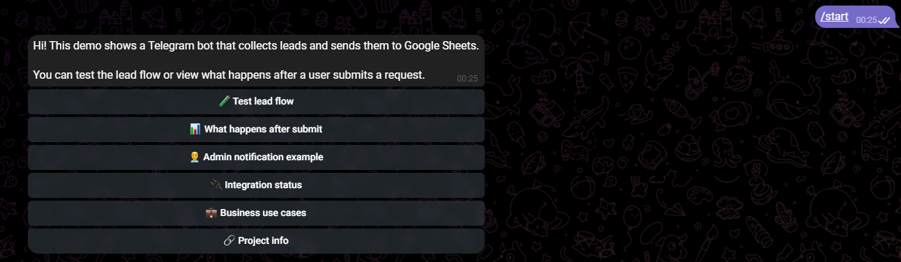 |
| Integration status | 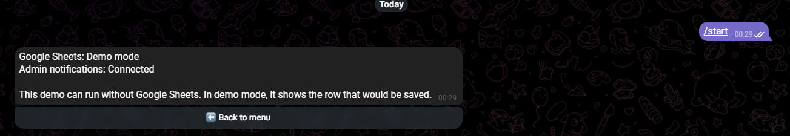 |
| Lead flow name step | 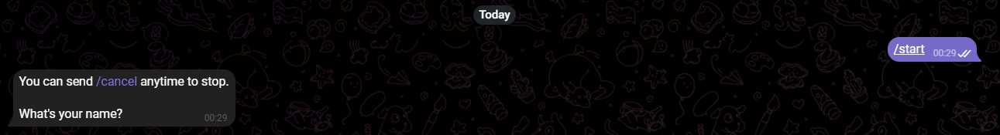 |
| Invalid email rejection | 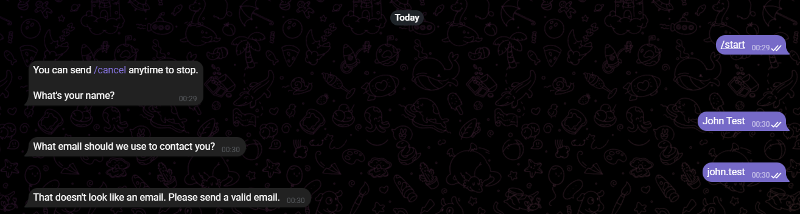 |
| Short message rejection | 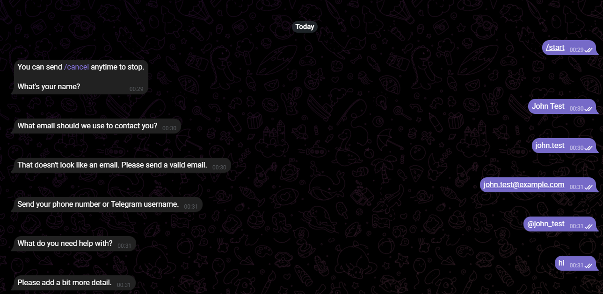 |
| Final lead confirmation | 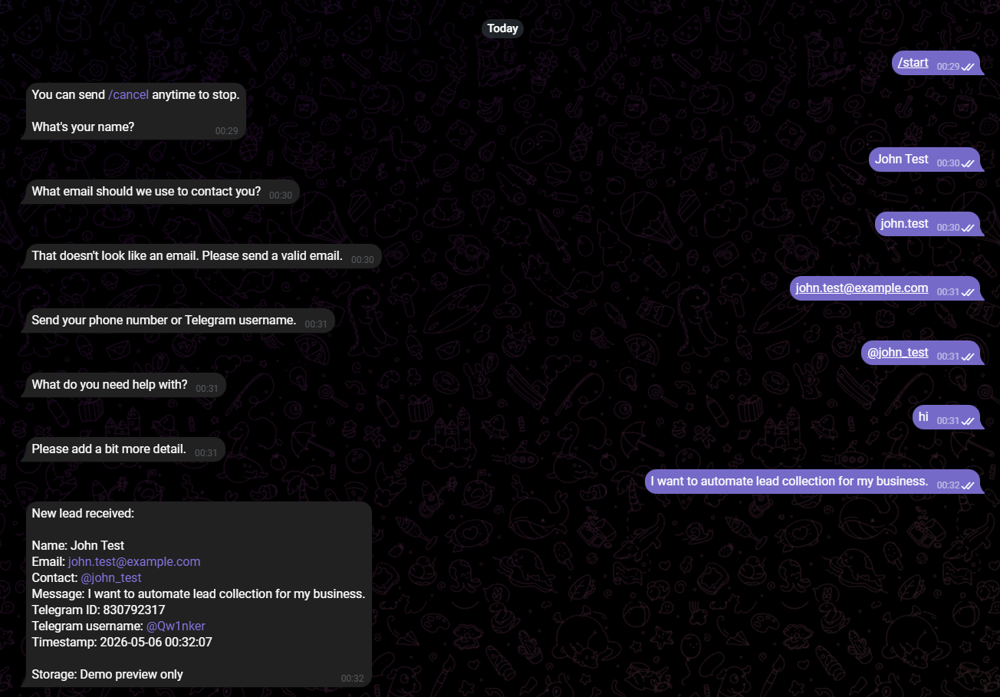 |
| Admin notification example | 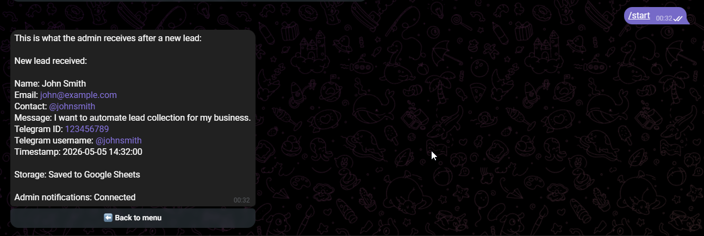 |
| What happens after submit | 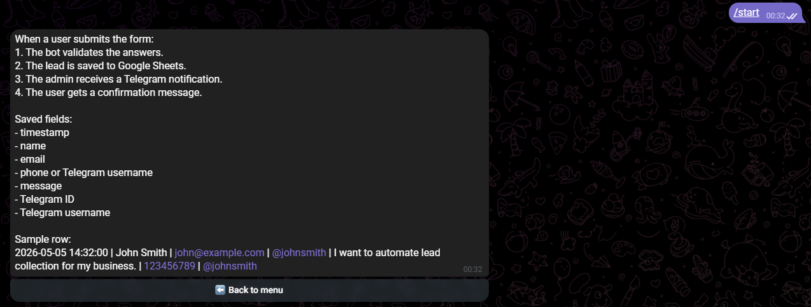 |
| Business use cases | 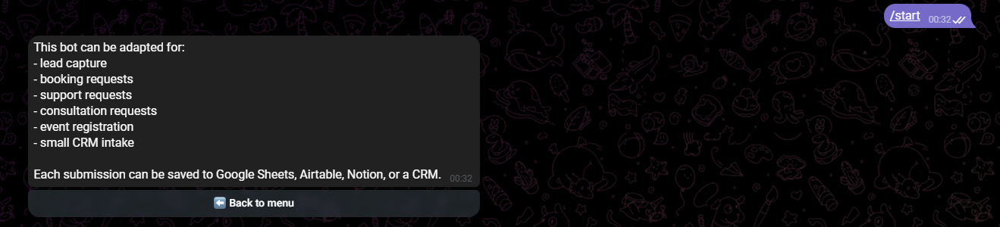 |
| Project info | 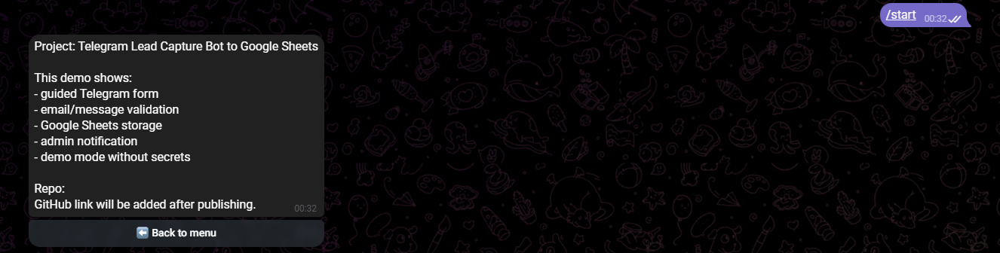 |
| Google Sheet row | 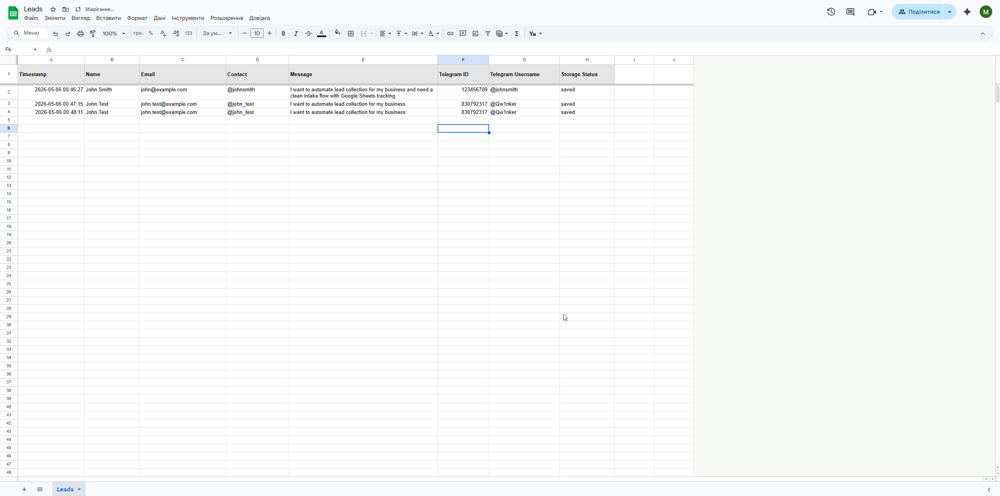 |
| Clean terminal logs | 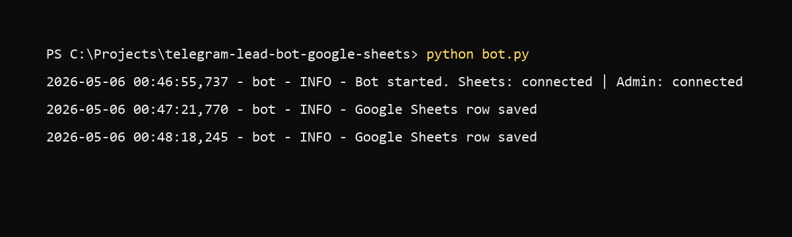 |

## How It Works

The `/start` menu presents the demo flow and supporting information pages.

When a lead is submitted:

1. The bot validates the answers.
2. If Google Sheets is configured, it appends the lead row.
3. If `ADMIN_CHAT_ID` is configured, it sends the admin notification.
4. The user receives a confirmation message.

Saved Google Sheets columns:

| Timestamp | Name | Email | Contact | Message | Telegram ID | Telegram Username | Storage Status |
|---|---|---|---|---|---|---|---|
| 2026-05-05 14:32:00 | John Smith | john@example.com | @johnsmith | I want to automate lead collection for my business. | 123456789 | @johnsmith | saved |

## Demo Mode

The bot can run without Google Sheets credentials.

If `SPREADSHEET_ID` is missing or the credentials file is unavailable:

- The lead flow still works.
- The collected row is previewed instead of saved.
- No Google setup error is shown to the Telegram user.

If `ADMIN_CHAT_ID` is missing:

- Admin notifications are skipped.
- The rest of the demo still works.

Use fake test data when running the demo locally.

## Full Setup

1. Create a Telegram bot with BotFather.
2. Clone this repository.
3. Create a virtual environment.
4. Install dependencies.
5. Copy `.env.example` to `.env`.
6. Add your local environment values.
7. Optional: configure Google Sheets.
8. Optional: configure admin notifications.
9. Run the bot.

## Environment Variables

Copy the example file:

```bash
cp .env.example .env
```

Windows PowerShell:

```powershell
Copy-Item .env.example .env
```

Variables:

| Variable | Required | Description |
|---|---:|---|
| `BOT_TOKEN` | Yes | Telegram bot token from BotFather |
| `ADMIN_CHAT_ID` | No | Telegram chat ID for admin notifications |
| `GOOGLE_CREDENTIALS_FILE` | No | Path to the Google service account JSON file |
| `SPREADSHEET_ID` | No | Google Sheet ID from the sheet URL |
| `SHEET_NAME` | No | Worksheet tab name. Defaults to `Leads` |
| `GITHUB_URL` | No | Repository URL shown in the bot Project info page |

Example:

```env
BOT_TOKEN=your_telegram_bot_token_here
ADMIN_CHAT_ID=your_admin_chat_id_here
GOOGLE_CREDENTIALS_FILE=credentials.json
SPREADSHEET_ID=your_google_spreadsheet_id_here
SHEET_NAME=Leads
GITHUB_URL=https://github.com/YOUR_USERNAME/telegram-lead-bot-google-sheets
```

Secrets are handled through `.env` and local credential files. They are not included in this repository.

## Google Sheets Setup

Google Sheets is optional. Skip this section for demo mode.

1. Go to [Google Cloud Console](https://console.cloud.google.com/).
2. Create or select a project.
3. Enable Google Sheets API.
4. Enable Google Drive API.
5. Go to IAM & Admin > Service Accounts.
6. Create a service account.
7. Create a JSON key and download it.
8. Save the key locally as `credentials.json` in the project root.
9. Create a Google Sheet.
10. Share the sheet with the service account email as Editor.
11. Copy the spreadsheet ID from the sheet URL.
12. Add the spreadsheet ID to `.env`.

The bot creates the worksheet tab if it does not exist.

The Google Sheet is automatically formatted with headers, frozen first row, readable column widths, and wrapped text for cleaner screenshots and easier review.

## Telegram BotFather Setup

1. Open Telegram and message [@BotFather](https://t.me/BotFather).
2. Send `/newbot`.
3. Follow the prompts.
4. Copy the API token.
5. Put it in `.env` as `BOT_TOKEN`.

To receive admin notifications:

1. Message a Telegram user info bot or use another safe method to get your chat ID.
2. Put the chat ID in `.env` as `ADMIN_CHAT_ID`.

## Run Locally

Create and activate a virtual environment:

```bash
python -m venv venv
```

Windows PowerShell:

```powershell
.\venv\Scripts\Activate.ps1
```

macOS/Linux:

```bash
source venv/bin/activate
```

Install dependencies:

```bash
pip install -r requirements.txt
```

Start the bot:

```bash
python bot.py
```

Expected clean startup logs:

```text
Bot started. Sheets: connected | Admin: connected
Bot started. Sheets: demo mode | Admin: not connected
```

## Deployment

This bot can be deployed to a VPS, Render, Railway, Fly.io, or any server that supports long-running Python processes.

Required production environment variables:

- `BOT_TOKEN`
- `ADMIN_CHAT_ID`
- `GOOGLE_CREDENTIALS_FILE` or equivalent secret file handling
- `SPREADSHEET_ID`
- `SHEET_NAME`

Do not include real secrets in the repository.

## Security Notes

- Do not commit `.env`.
- Do not commit `credentials.json`.
- Do not commit Telegram bot tokens.
- Do not commit Google service account keys.
- Do not commit private admin chat IDs.
- Do not commit private user data.
- Do not share terminal logs if they include tokens or private data.
- If a token is exposed, revoke it in BotFather and replace it in `.env`.
- Use fake test data in screenshots and portfolio demos.

## Business Use Cases

This bot can be adapted for:

- Lead capture
- Booking requests
- Support requests
- Consultation requests
- Event registration
- Small CRM intake

Each submission can be saved to Google Sheets, Airtable, Notion, or a CRM.

## Tech Stack

- Python 3.10+
- python-telegram-bot
- Google Sheets API
- gspread
- google-auth
- python-dotenv

## Screenshots Checklist

Expected public screenshots:

- `01_start_menu.png`
- `02_integration_status.png`
- `03_lead_flow_name_step.png`
- `04_invalid_email_rejection.png`
- `05_short_message_rejection.png`
- `06_final_lead_confirmation.png`
- `07_admin_notification_example.png`
- `08_what_happens_after_submit.png`
- `09_business_use_cases.png`
- `10_project_info.png`
- `11_google_sheet_row.png`
- `12_terminal_running.png`

## Testing

```bash
python -m py_compile bot.py sheets.py config.py keyboards.py
```

## License

MIT
